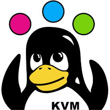
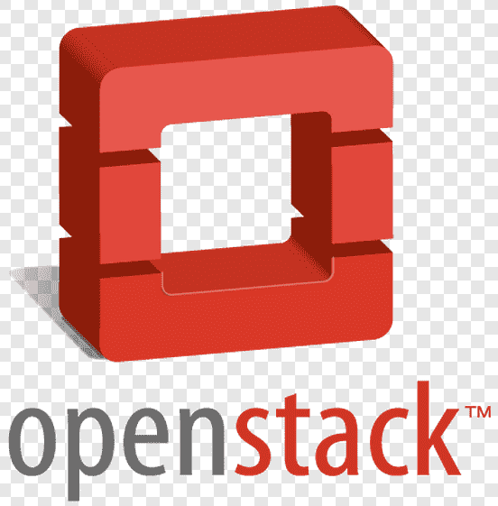
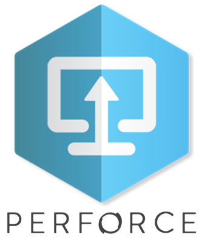
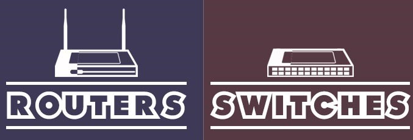
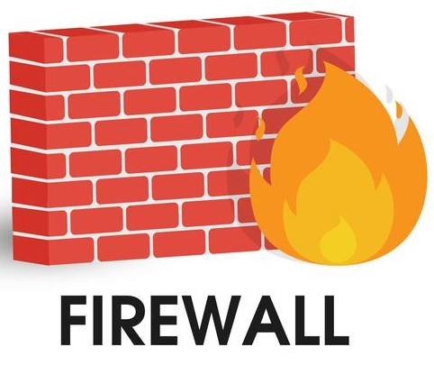

### Hello! 🙏🏽

✅ About Me
- Software Developer with extensive experience of 8+ years in developing System Platform Software, Network Datapath, Applications and Tools for Next Generation Firewalls (NGFW), Switches and Access points.
- Proficient in Layer 2, 3, 4 & 7 networking, Network Security, Cloud Computing, Virtualization, Containerization, Linux Internals, Software Architecture, with a keen grasp of latest technologies.
- Committed to fostering collaboration among Engineering, QA and Support teams to implement system-level improvements that benefit end-users.

🎓 Education
- Master of Technology in Software Systems – Security from Birla Institute of Technology and Science. 2021 – 2023
- Bachelor of Engineering in Computer Science & Engineering from Visvesvaraya Technological University. 2011 – 2015

⚙️ Work
<table> <tr> 
<td>

- System Software
- Network Datapath
- TCP/IP
- Firewalls, Switches, Routers
- vNIC Drivers
</td>
<td>

- Performance
- Linux Kernel
- Cloud Computing
- Virtualization
- DPDK
</td> </tr> </table>

💻 Skill Set:

- C, C++, Python, Bash, Javascript
- 

 
 
 

