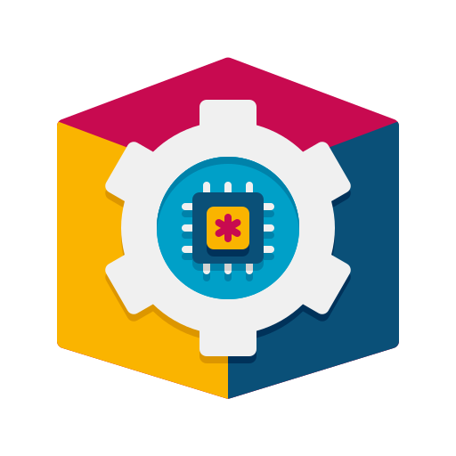
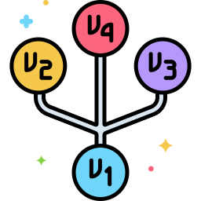

## Hello! 🙏🏽

  <b> About Me </b>  
★ Software Developer with a Masters in Software Systems and an extensive experience of 8+ years in developing System Platform Software, Network Datapath, Applications and Tools.

★ Proficient in Layers 2,3,4&7 networking, Network Security, Virtualization, Cloud Computing, Linux Internals, Containerization, Software Architecture, with a keen grasp of latest technologies.

★ Hands-on experience in design, configuration, development, and troubleshooting of diverse public and private cloud platforms and networking products including firewalls, routers, and switches.

★ Collaborative team player experienced in fostering relationships across cross-functional teams, contributing effectively to collective objectives, and achieving successful project outcomes.

★ Highly adaptable professional, adept at active listening, encouraging open dialogue, and valuing diverse perspectives within team settings, contributing to cohesive and productive work environments.

★ Adept at developing diagnostic tools and utilities to troubleshoot issues efficiently.

  <a href="https://github.com/ravikumark815/resume/blob/master/Resume.pdf">My Résumé</a>  

  <b> Education </b>  
- <a href="https://github.com/ravikumark815/certifications/blob/master/Masters_Degree.pdf">Master of Technology</a> in Software Systems – Security from Birla Institute of Technology and Science. 2021 – 2023 
- <a href="https://github.com/ravikumark815/certifications/blob/master/Bachelors_Degree.pdf">Bachelor of Engineering</a> in Computer Science & Engineering from Visvesvaraya Technological University. 2011 – 2015

  <b> Work </b>  
<table> <tr> 
<td>

- System Software
- Network Datapath
- TCP/IP
- Firewalls, Switches, Routers
- vNIC Drivers
</td>
<td>

- Performance
- Linux Kernel
- Cloud Computing
- Virtualization
- DPDK
</td> </tr> </table>

  <b> Skill Set </b>  

  C, C++, Python3, Bash, Javascript, Terraform, REST, JSON, XML  
  HTML5, CSS, Javascript, REST, JSON, XML  
  AWS, Azure, GCP, Oracle Cloud (OCI), Alibaba Cloud  
  KVM, VMware, Intel DPDK  
  Docker, Kubernetes  
  TCP/IP, Network Security, SSL/TLS, VPN, Routing and Switching, NAT, High Availability, IPSec, STP, VLAN.  
  GDB, GCOV, Strace, Perf, TRex  
  Git, Perforce, Gerrit, Jira, Confluence, Target Process, Agile, Kanban  
  Visual Studio, Linux, MS Office, Windows  

 