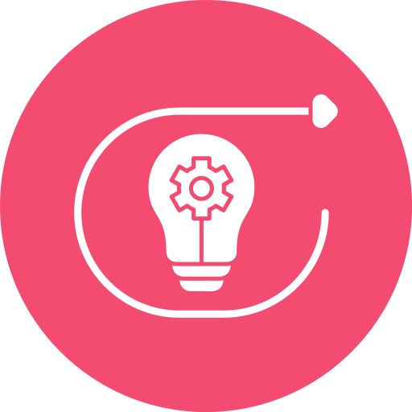
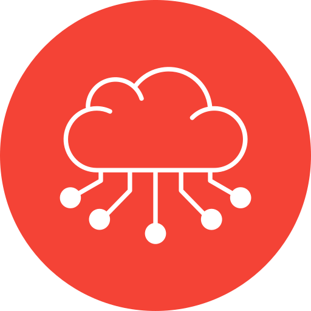

## Hello! 🙏🏽

  <b> About Me </b>  
- Software Developer with extensive experience of 8+ years in developing System Platform Software, Network Datapath, Applications and Tools for Next Generation Firewalls (NGFW), Switches and Access points.
- Proficient in Layer 2, 3, 4 & 7 networking, Network Security, Cloud Computing, Virtualization, Containerization, Linux Internals, Software Architecture, with a keen grasp of latest technologies.
- Committed to fostering collaboration among Engineering, QA and Support teams to implement system-level improvements that benefit end-users.

  <b> Education </b>  
<a href="https://github.com/ravikumark815/certifications/blob/master/Masters_Degree.pdf">- Master of Technology in Software Systems – Security from Birla Institute of Technology and Science. 2021 – 2023</a> 
<a href="https://github.com/ravikumark815/certifications/blob/master/Bachelors_Degree.pdf">- Bachelor of Engineering in Computer Science & Engineering from Visvesvaraya Technological University. 2011 – 2015</a>

  <b> Work </b>  
<table> <tr> 
<td>

- System Software
- Network Datapath
- TCP/IP
- Firewalls, Switches, Routers
- vNIC Drivers
</td>
<td>

- Performance
- Linux Kernel
- Cloud Computing
- Virtualization
- DPDK
</td> </tr> </table>

  <b> Skill Set </b>  

  C, C++, Python, Bash, Javascript, Terraform, REST, JSON, XML  
  AWS, Azure, GCP, Oracle Cloud (OCI), Alibaba Cloud  
  TCP/IP, Network Security, NAT, High Availability, SSL/TLS, VPN, Firewalls, Routing, Switching  
  KVM, VMware, DPDK, VPP  
  Docker, Kubernetes  
  Git, Perforce, Jira, Confluence, Target Process, Agile, Linux, Windows  